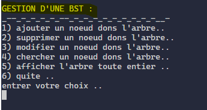
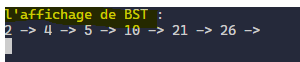
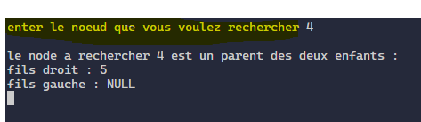

# BST
> un programe qui permet de faire la gestion d'une arbre binaire de recherche

## Fonctionalite

- [x] consiltation des different noeud de l'arbre
- [x] recherche d'un noeud dons l'arbre
- [x] l'ajoute d'un nouvel noeud de l'arbre
- [x] la suppresion d'un noeud qui se trouve dons l'rbre
- [x] la fermeture du programme

## L'execution de programme

 <h1 align="center">
   
 
   
  L'INTERFACE UTILISATEUR
</h1>
<h1 align="center">
   
 
   
</h1>
<h1 align="center">
   
 
   
</h1>
